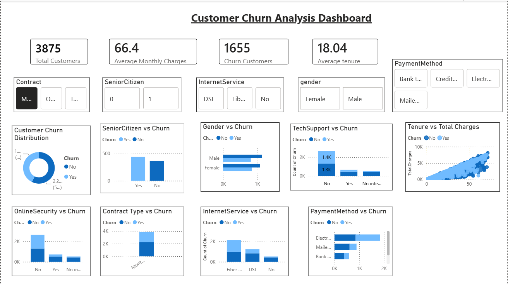
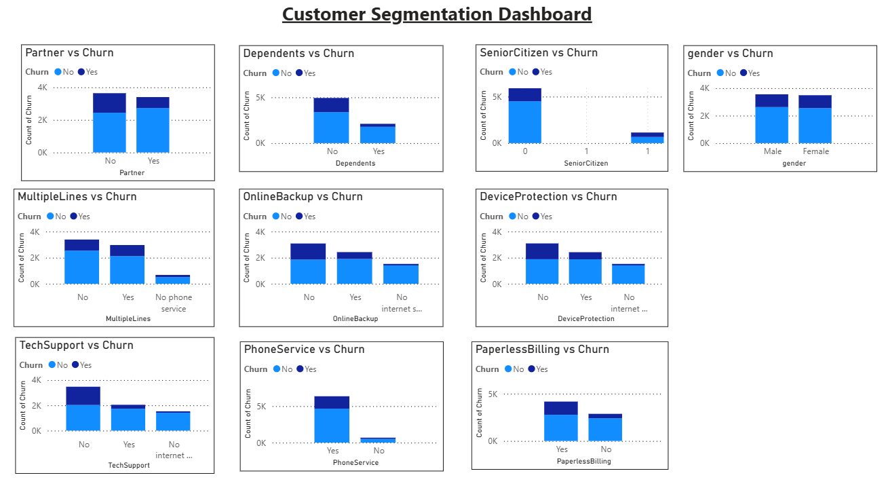
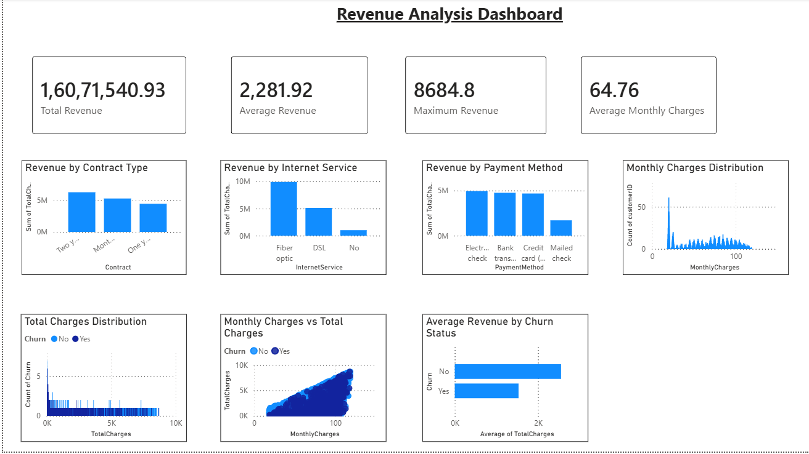

# Customer Churn Prediction Project

## Live demo

Streamlit App: https://dharani26-art-customer-churn-prediction-app-eqjeqm.streamlit.app/

### Project Overview

This project predicts whether a telecom customer will churn (leave the service) or stay using Machine Learning.

The project includes:

* Data Cleaning & Preprocessing
* Exploratory Data Analysis (EDA)
* Logistic Regression Model
* Streamlit Web Application
* Power BI Dashboard
* Business Insights

### Dataset

IBM Telco Customer Churn Dataset

Features include:

* Gender
* Senior Citizen
* Partner
* Dependents
* Internet Service
* Contract Type
* Monthly Charges
* Total Charges
* Tenure
* Payment Method
* PhoneService 
* MultipleLines
* OnlineSecurity 
* OnlineBackup
* DeviceProtection
* TechSupport
* StreamingTV
* StreamingMovies 
* PaperlessBilling
       

Target Variable:

* Churn (Yes / No)

### Machine Learning Model

### Logistic Regression

Model Accuracy: 81.97%

### Why Logistic Regression?

* Binary Classification Problem
* Easy to Interpret
* Fast Training
* Better Accuracy than XGBoost on this dataset

### Model Comparison based on Accuracy

* Logistic Regression = 81.97% 
* XGBoost = 81.12% 

## Technologies Used

* Python
* Pandas
* NumPy
* Scikit-Learn
* Streamlit
* Power BI
* Matplotlib
* Seaborn

## Power BI Dashboard

### Page 1 - Customer Churn Analysis

### Page 2 - Customer Segmentation Dashboard

###  Page 3 - Revenue Analysis Dashboard

## Business Insights

- Month-to-month customers have higher churn rates.
- Customers without Tech Support churn more frequently.
- Customers without Online Security churn more frequently.
- Long-tenure customers are less likely to churn.
- Fiber Optic customers generate higher revenue.

## Streamlit Application

The Streamlit app allows users to:

- Enter customer information
- Predict churn probability
- Identify customers at risk of leaving

## Author

**Dharani Ragipati**

Aspiring Data Scientist | Machine Learning | Power BI | Python 
# Customer Churn Prediction
